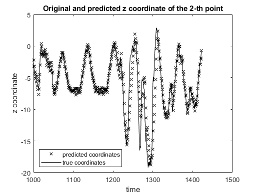

This program predicts multidimensional time-series data using a recurrent neural network (RNN)
trained by real-time recurrent learning (RTRL), unbiased online recurrent optimization (UORO), least mean squares (LMS), or multivariate linear regression.

The figure below gives an example of prediction 2.0s in advance with UORO (the sampling rate is 10Hz). 

This code supports the claims in the following research article:
Pohl, Michel, et al. "Prediction of the Position of External Markers Using a Recurrent Neural Network Trained With Unbiased Online Recurrent Optimization for Safe Lung Cancer Radiotherapy", Computer Methods and Programs in Biomedicine (2022): 106908. 
You can access it with the following links:
 - https://doi.org/10.1016/j.cmpb.2022.106908 (journal version with restricted access)
 - http://arxiv.org/abs/2106.01100 (accepted manuscript version, openly available)
Please consider citing our article if you use this code in your research.

The data provided in the directories "1. Input time series sequences" and "Original data" consists of the three-dimensional position of external markers placed on the chest and abdomen of healthy individuals breathing during intervals from 73s to 222s. The markers move because of the respiratory motion, and their position is sampled at approximately 10Hz.
The same data was used and described in the following article:
Krilavicius, Tomas, et al. “Predicting Respiratory Motion for Real-Time Tumour Tracking in Radiotherapy.” ArXiv:1508.00749 [Physics], Aug. 2015. arXiv.org, http://arxiv.org/abs/1508.00749.

Our implementation of RTRL is based on chapter 15 ("Dynamically Driven Recurrent Networks") of the following book :
Haykin, Simon S. "Neural networks and learning machines/Simon Haykin." (2009).

Three main functions can be executed :
 1) one corresponds to the file "prediction_main.m"
 2) the second corresponds to the file "hyperparameter_optimization_main.m".
 3) the third corresponds to the file "convert_csv_to_mat.m"
 
"prediction_main.m" performs prediction for a given prediction method and set of hyper-parameters, which can be set manually in the files "pred_par.xlsx" and "load_pred_par.m".
The results are saved in the folders "2. Prediction results (figures)", "3. Prediction results (images)", and "5. Log txt files".
The log files contain information relative to the numerical accuracy of the prediction.
The behavior of that main function can be set manually in the file "load_behavior_parameters.m".
The time-series sequences used can be selected in the file "load_path_parameters.m", by commenting or uncommenting the corresponding text strings.
Parameters relative to display can be selected manually in the file "disp_par.xlsx".

"hyperparameter_optimization_main.m" performs grid search on the cross-validation set to determine the optimal hyper-parameters for each sequence and provide information about the influence of each hyper-parameter on the prediction accuracy.
The set of hyper-parameters used can be selected manually in the file "load_hyperpar_cv_info.m".

"hyperparameter_optimization_main.m" uses parallel computations to make grid search faster.
Therefore, the parallel processing toolbox of Matlab is normally required to use "hyperparameter_optimization_main.m".
It can also be used without that toolbox by replacing all the "parfor" instructions by "for" instructions, at the expense of a higher processing time.

One can also use GPU computing to try to make the RNN calculations faster by setting the variable "beh_par.GPU_COMPUTING" to true.
In that case, the parallel processing toolbox of Matlab is required.
Calculations are faster with the GPU when using RTRL with a relatively high number of hidden units.

"convert_csv_to_mat.m" converts the original csv data from the article by Krilavicius et al. in the "Original data" folder into the "data.mat" files in the "Input time series sequences" folder that "prediction_main.m" and "hyperparameter_optimization_main.m" can use.

 	

