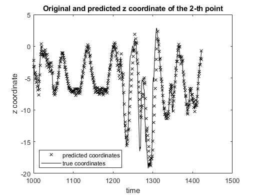

# Multivariate respiratory-motion time-series forecasting using RNNs trained with UORO and RTRL

**Note**: This repository contains the original code supporting my paper on UORO published in 2022 (see ["References"](#references) section). A newer consolidated implementation is available in the [`Time_series_forecasting folder`](https://github.com/pohl-michel/2D-MR-image-prediction/blob/main/Time_series_forecasting/README.md) of the `2D-MR-image-prediction` repository, which contains additional online learning algorithms for RNNs (DNI and SnAp-1), transformer models, and more general evaluation settings.

## Overview

This repository contains MATLAB code for forecasting multivariate time-series data. Specifically, the code implements vanilla RNNs trained online with unbiased online recurrent optimization (UORO) or real-time recurrent learning (RTRL), together with least mean squares (LMS) and ordinary least-squares linear autoregressive baselines. The data provided here consists of the 3D positions of external markers on the chest and abdomen of individuals lying face up during breathing. 

The figure below gives an example of prediction 2.0s in advance with UORO (the sampling rate is 10Hz). 

Our implementation of RTRL is based on chapter 15 ("Dynamically Driven Recurrent Networks") of the following book :
Haykin, Simon S. "Neural networks and learning machines/Simon Haykin." (2009).

## Data

The data provided in the directories "1. Input time series sequences" and "Original data" consists of the three-dimensional position of external markers placed on the chest and abdomen of healthy individuals breathing during intervals from 73s to 222s. The markers move because of the respiratory motion, and their position is sampled at approximately 10Hz.
The same data was used and described in the following article:
Krilavicius, Tomas, et al. “Predicting Respiratory Motion for Real-Time Tumour Tracking in Radiotherapy.” ArXiv:1508.00749 [Physics], Aug. 2015. arXiv.org,  	
https://doi.org/10.48550/arXiv.1508.00749.

## How to run

Three scripts can be executed :
 1) one corresponds to the file "prediction_main.m"
 2) the second corresponds to the file "hyperparameter_optimization_main.m".
 3) the third corresponds to the file "convert_csv_to_mat.m"
 
"prediction_main.m" performs prediction for a given prediction method and set of hyperparameters, which can be selected manually in the files "pred_par.xlsx" and "load_pred_par.m".
The results are saved in the folders "2. Prediction results (figures)", "3. Prediction results (images)", and "5. Log txt files".
The log files contain information relative to the numerical accuracy of the prediction.
The behavior of that main function can be set manually in the file "load_behavior_parameters.m".
The time-series sequences used can be selected in the file "load_path_parameters.m", by commenting or uncommenting the corresponding text strings.
Parameters relative to display can be selected manually in the file "disp_par.xlsx".

"hyperparameter_optimization_main.m" performs grid search on the cross-validation set to determine the optimal hyperparameters for each sequence and provide information about the influence of each hyperparameter on the prediction accuracy.
The set of hyperparameters used can be selected manually in the file "load_hyperpar_cv_info.m".

"hyperparameter_optimization_main.m" uses parallel computations to make grid search faster.
Therefore, the parallel processing toolbox of Matlab is normally required to use "hyperparameter_optimization_main.m".
It can also be used without that toolbox by replacing all the `parfor` instructions by `for` instructions, at the expense of a higher processing time.

One can also use GPU computing to try to make the RNN calculations faster by setting the variable `beh_par.GPU_COMPUTING` to `true`.
In that case, the parallel processing toolbox of Matlab is required.
Calculations are faster with the GPU when using RTRL with a relatively high number of hidden units.

"convert_csv_to_mat.m" converts the original csv data from the article by Krilavicius et al. in the "Original data" folder into the "data.mat" files in the "Input time series sequences" folder that "prediction_main.m" and "hyperparameter_optimization_main.m" can use.

## References

This code supports the claims in the following research article:

Michel Pohl, Mitsuru Uesaka, Hiroyuki Takahashi, Kazuyuki Demachi, Ritu Bhusal Chhatkuli, "Prediction of the Position of External Markers Using a Recurrent Neural Network Trained With Unbiased Online Recurrent Optimization for Safe Lung Cancer Radiotherapy", Computer Methods and Programs in Biomedicine (2022): 106908. [[Published version]](https://doi.org/10.1016/j.cmpb.2022.106908) [[arXiv]](https://doi.org/10.48550/arXiv.2106.01100)

Please consider citing our article if you use this code in your research. An accessible summary of this work is available as a Towards Data Science Editors’ Pick article, also mirrored on my personal blog:

Michel Pohl, "Predicting respiratory motion using online learning of recurrent neural networks for safer lung radiotherapy", Towards Data Science (2022) [[Medium]](https://medium.com/towards-data-science/forecasting-respiratory-motion-using-online-learning-of-rnns-for-safe-radiotherapy-bdf4947ad22f) [[Personal blog]](https://pohl-michel.github.io/blog/articles/predicting-respiratory-motion-online-learning-rnn/article.html)
